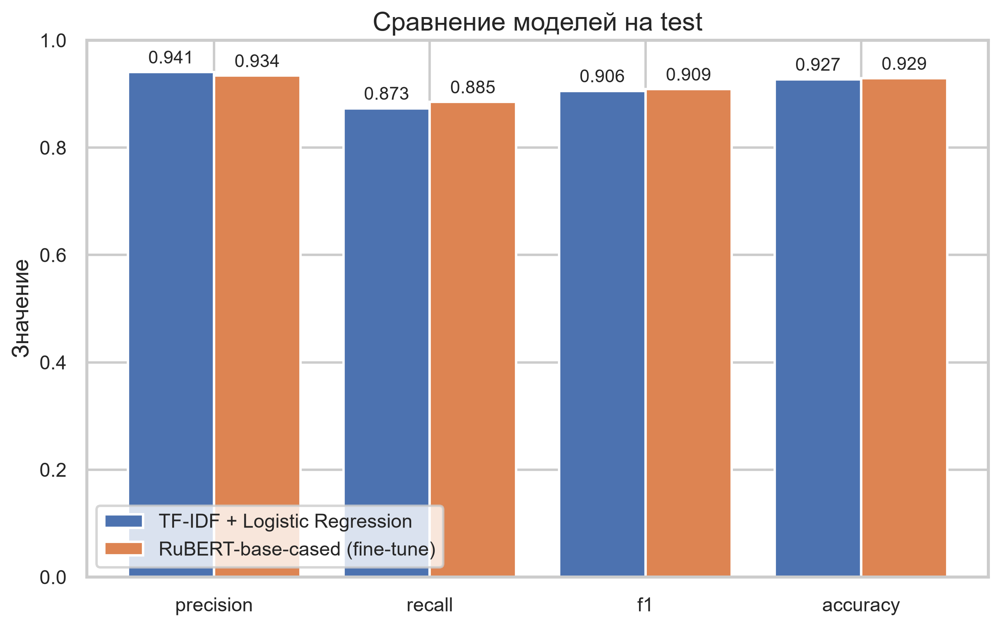

# inbox-cleaner

Бенчмарк классификации спама: fine-tuning RuBERT против линейной модели на
собственном корпусе русскоязычных писем, с общим протоколом обучения и честным
сравнением на отложенной выборке. Обученная модель обёрнута в HTTP-сервис.

## Задача проекта

Классификация входящих писем на спам и обычные письма на собственном корпусе
9868 русскоязычных писем. Проект — не «обучить модель», а **бенчмарк**: на одних
и тех же данных и по одному протоколу сравниваются две модели противоположного
устройства.

| Модель | Что это | Зачем в проекте |
| ------ | ------- | --------------- |
| **RuBERT-base-cased** (fine-tune) | трансформер, дообучается целиком на письмах | сильная языковая модель для русского, верхняя планка качества |
| TF-IDF + Logistic Regression | разреженные признаки + линейная модель | честный и быстрый базовый уровень, с которым сравнивают |

Обе модели обучаются на `train_split.csv`, гиперпараметры выбираются на
`val_split.csv`, а единственный отчёт — на `test.csv`. Сравнение бессмысленно,
если условия не совпадают, поэтому протокол общий (см. «Бенчмарк»).

Разница в качестве небольшая — f1 0.9089 против 0.9058, — но она честная: обе
модели видели одинаковые данные, отбирались на одной и той же отложенной
выборке и отчитывались на одной и той же выборке. Отделить вклад «нейросети» от
вклада «длины текста» здесь нельзя, и это стоило отдельного прогона: при
`max_length=128` линейная модель выигрывала, при 512 — выигрывает RuBERT.

## Почему RuBERT

Письма в корпусе **на русском языке**, и RuBERT — одна из немногих моделей,
обученных на русском тексте, а не переведённая с английского. Это не
предпочтительная претензия, а требование задачи: у TF-IDF нет языковой модели
вообще, векторизатор работает с любыми символами одинаково, а трансформенту
нужен словарь и предобучение именно на том же языке. Русские словоформы,
морфология и сокращения в спаме — то, где линейная модель по bag-of-words
заведомо теряет, а RuBERT использует контекст.

Взята базовая версия `DeepPavlov/rubert-base-cased` (178 М параметров), а не
`large`: она обучается здесь за 9,2 минуты на потребительской карте, и разница
в f1 того не стоит — сверх этой задачи в проекте важна воспроизводимость прогона.

## Данные

Собственный корпус писем, **9868 примеров**, из них:

| Класс | Примеров | Доля |
| ----- | -------- | ---- |
| `ham` (обычные письма) | 5921 | 60,0 % |
| `spam` (спам) | 3947 | 40,0 % |

Разбивка сделана так, что пропорция классов сохранилась в каждой части — это
видно по таблице ниже. Классы **не выровнены** (60 на 40), и из этого следует
важное для чтения метрик: при перевесе в ham accuracy всегда выглядит
прилично, поэтому главная метрика проекта — **f1**, а не accuracy.

| Выборка | Примеров | ham | spam | Для чего |
| ------- | -------- | --- | ---- | -------- |
| `train_split.csv` | 5870 | 60,0 % | 40,0 % | обучение обеих моделей |
| `val_split.csv` | 1037 | 60,0 % | 40,0 % | отбор эпохи, порога и `C` |
| `test.csv` | 2961 | 60,0 % | 40,0 % | единственный отчёт, 30 % всех писем |

## Стек

Python **3.12+**, зависимости и сборка — на `uv`.

| Слой | Инструменты |
| ---- | ---------- |
| Модель | `transformers` (RuBERT), `torch` (PyTorch, CUDA 12.6) |
| Baseline | `scikit-learn` (TF-IDF + Logistic Regression) |
| Данные | `pandas` |
| API | `FastAPI`, `uvicorn`, `pydantic` |
| Графики | `matplotlib`, `seaborn` |
| Инфраструктура | `uv` (экстры `cpu` / `gpu`), `pytest`, `ruff` |

## Быстрый старт

Нужен Python 3.12+ и [uv](https://docs.astral.sh/uv/). Для RuBERT — видеокарта
NVIDIA с CUDA 12.6; линейная модель считается на CPU за секунды.

```bash
# 1. Окружение с torch для CUDA. Без экстры torch не установится, а с
#    CPU-колесом обучение пойдёт не минуты, а часы.
uv sync --extra gpu --dev

# 2. Линейная модель — секунды, отдельного GPU не нужно
uv run python scripts/baseline.py

# 3. Fine-tuning RuBERT — 9,2 минуты на RTX 3060 Ti.
#    Первый запуск скачивает веса rubert (~680 МБ) из HuggingFace.
uv run python -m model.train

# 4. Сравнительный отчёт: таблица в консоль + comparison.png
uv run python scripts/compare.py

# 5. Запуск сервиса классификации
uv run python main.py          # http://127.0.0.1:8000
```

Шаги 2–4 независимы: `baseline.py` и `model.train` можно запускать в любом
порядке, а `compare.py` читает уже готовые CSV и ничего не обучает.

Проверить, что всё встало:

```bash
uv run pytest -q                 # все тесты
uv run python -c "import torch; print(torch.cuda.is_available())"   # должно быть True
```

## Архитектура

Проект разделён на слои, каждый из которых живёт в своей папке и не должен
знать о внутренностях соседних слоёв. Обмен идёт через явные контракты
(Pydantic-схемы, файлы артефактов, HTTP-вызовы).

```
inbox-cleaner/
├── model/       # данные, обучение, инференс, метрики, версионирование модели
├── service/     # HTTP-сервис (FastAPI) поверх модели
├── common/      # общее для всех слоёв: конфиг, логирование, метрики, графики
├── scripts/     # вспомогательные скрипты: baseline, сравнение, разбор ошибок
├── tests/       # тесты
└── pyproject.toml
```

### Слои и их зоны ответственности

| Слой        | Отвечает за                                                       | Не делает                                   |
| ----------- | ----------------------------------------------------------------- | ------------------------------------------- |
| `model/`    | загрузку данных, обучение, инференс, сохранение артефакта          | не ходит в сеть и не знает про HTTP          |
| `service/`  | REST-обёртку: валидация запроса, вызов `model`, ответ клиенту      | не содержит логики обучения                  |
| `scripts/`  | обучение baseline, сравнение моделей, разбор ошибок               | не импортирует `service`                     |
| `common/`   | конфиг, логирование, метрики, графики, метки классов              | не зависит ни от одного из слоёв             |

Правило зависимостей: `service` → `model` → данные. Обратные и «прыгающие»
импорты запрещены. `common/` стоит вне цепочки: его импортируют все, но он не
импортирует никого. Именно поэтому общие для baseline и RuBERT метрики и
графики лежат в `common/`, а не в `scripts/`: `model` не должен импортировать
`scripts`, иначе правило слоёв нарушается.

## Правила коммитов

Сообщение коммита начинается со **скоупа** — названия папки, которую затрагивает
изменение. Это делает историю репозитория читаемой без чтения диффа.

| Скоуп      | Когда использовать                                                        |
| ---------- | ------------------------------------------------------------------------- |
| `data:`    | любые изменения данных: новые выгрузки, очистка, разбиение, разметка     |
| `model:`   | код обучения/инференса, артефакты модели, метрики                         |
| `service:` | API, схемы запросов/ответов, эндпоинты                                    |
| `scripts:`  | вспомогательные скрипты: baseline, сравнение, разбор ошибок                 |
| `common:`   | конфиг, логирование, общие метрики и графики                               |
| `ci:`      | GitHub Actions, пайплайны, линтеры в CI                                   |
| `docs:`    | README, `context.md`, комментарии и документация, не меняющие код         |
| `chore:`   | инфраструктура вне папок: `.gitignore`, `pyproject.toml`, зависимости     |
| `init:`    | первичный коммит, создание каркаса проекта                                 |
| `test:`    | тесты, маркеры, фикстуры и ослабление или ужесточение проверок           |

Формат сообщения:

```
<скоуп>: <что изменилось коротко> в императиве
```

Примеры:

```
data: обновлён train.csv после переразметки 1200 писем
model: логрегрессия на TF-IDF, f1 0.84 на test
service: добавлен эндпоинт POST /predict с валидацией размера текста
common: подбор порога вынесен в общий модуль метрик
scripts: TF-IDF baseline и разбор ошибок на test
ci: ruff и pytest в push-pipeline
test: тесты кода моделей помечены и исключены из CI
```

Дополнительные правила:

- Один коммит — одна логическая задача; не смешивать `data` и `model`.
- Если изменение затрагивает несколько папок, выбирается **главный** скоуп,
  остальные папки упоминаются в теле сообщения.
- Тело сообщения — через пустую строку, там «почему», а не «что».
- В `data:` не коммитится ничего, что можно воспроизвести из источника,
  если только это не согласованный корпус (Label Studio, обезличенные выгрузки).

## Логирование

Вывод в терминал идёт только через `logging`. Точка настройки одна —
`common/logging_setup.py`, от которой зависят все слои и которая не зависит
ни от одного из них.

```python
from common.logging_setup import get_logger

logger = get_logger(__name__)
logger.info("  train: %d примеров", len(train_ds))   # ленивое форматирование
```

Библиотечный код только берёт логгер. `setup_logging()` вызывают только точки
входа: `model/train.py`, `service/api.py` и скрипты в `scripts/`.

Уровень по умолчанию — `WARNING`: в консоли остаются предупреждения, ошибки и
возможные остановки. `INFO` поднят только логгерам пакета `model`
(`INFO_PACKAGES` в `common/logging_setup.py`), поэтому прогресс и метрики
обучения видны, а `service` и `scripts` молчат. Файла логов нет, строка вывода —
имя модуля и текст сообщения, всё остальное отброшено.

| Правило | Зачем |
| ------- | ----- |
| Аргументы через `%s`, не f-строки | строка собирается только если уровень попадёт в вывод |
| Свои сообщения на русском | проект русский, ошибки должен читать тот, кто их чинит |
| Тексты чужих исключений не переводятся | их пишет библиотека, перевод только врёт |
| `errors="replace"` на stderr | консоль в cp1251/cp866 не падает на символах вне кодировки |
| `INFO` только у пакета `model` | прогресс обучения виден, остальное не шумит |
| Формат `модуль: сообщение` | без времени и уровня, лишнего шума нет |
| Логи в stderr, не stdout | stdout остаётся чистым и перенаправляется в файл |
| Сообщения длиннее 1000 символов заменяются заглушкой | текст письма в консоль не попадает |
| Текст писем не логируется | даже в `error_analysis.py` он пишется только в CSV |

## Бенчмарк: RuBERT против линейной модели

Состав корпуса — в разделе «Данные». Здесь важно то, **как** модели сравниваются:
протокол общий, иначе сравнение бессмысленно.

| Выборка | Для чего |
| ------- | -------- |
| `train_split.csv` | обучение обеих моделей |
| `val_split.csv` | ранняя остановка RuBERT и подбор порога для обеих |
| `test.csv` | единственная отчётная выборка, на ней ничего не подбирается |

Порог не зашит в коде: он выбирается по f1 на val, метрики на test считаются
при нём, а выбранное значение кладётся в CSV. Поэтому линейная модель не
получает порог, придуманный для RuBERT, и каждая модель отчитывается на своей
рабочей точке. Линейная модель на val подбирает ещё и регуляризацию `C` (грид
`C_GRID` в `common/config.py`), RuBERT — номер эпохи по ранней остановке.
Гиперпараметры обеих моделей выбираются на val, test не участвует в выборе.

### Порядок запуска

Команды — в разделе «Быстрый старт», здесь только то, что относится к бенчмарку.

`torch` лежит не в базовых зависимостях, а в двух экстрах, потому что колесо
для GPU и для CPU различаются на 2,3 ГБ. Подробности — в разделе «Torch».

Требуется версия с CUDA 12.6. Обучение на CPU поддерживается, но штатно
запрещено: `model/train.py` без карты завершается с кодом 2 и объяснением, а
явное согласие даёт флаг `--allow-cpu` (на этой машине — около 3,5 часов, то
есть прогон имеет смысл только для отладки).

### Что даёт GPU

На RTX 3060 Ti 8 ГБ полный цикл занимает **9,2 минуты** вместо ~3,5 часов на
CPU. Даёт это не «просто включение CUDA», а четыре решения:

| Решение | Зачем |
| ------- | ----- |
| `MAX_LENGTH = 512` | при 128 модель читала только верхнюю четверть письма (медиана писем — 291 токен), и baseline сравнивался с ней на неравных правах |
| `batch_size = 16`, 4 эпохи | 16 × 512 в fp16 укладывается в 8 ГБ с запасом; больше 4 эпох val f1 уже не растёт |
| TF32 + `float32_matmul_precision("high")` | в 2–3 раза быстрее fp32 на Ampere без потери точности |
| чекпоинт в fp16 | файл 355 МБ вместо 678 МБ, метрики от этого не меняются |

Конфигурация обучения — в `common/config.py` (`MAX_LENGTH`, `SEED`) и в
`CONFIG` в начале `model/train.py`. Зерно 42 фиксировано, поэтому два прогона
сравнимы между собой.

### Артефакты

Все файлы кладутся в корень репозитория. Исключение — `comparison.png`: он
закоммичен, потому что на него ссылается этот README.

| Файл | Что внутри | В репозитории |
| ---- | ---------- | ------------- |
| `baseline_metrics.csv` | метрики линейной модели на test, её порог и `C` | нет |
| `baseline_predictions.csv` | по каждому письму: `target`, `pred` (словами `spam`/`ham`), `prob`, `text` | нет |
| `baseline_metrics.png` | столбчатая диаграмма метрик линейной модели | нет |
| `rubert_metrics.csv` | метрики RuBERT на test (колонки те же) | нет |
| `rubert_metrics.png` | столбчатая диаграмма метрик RuBERT | нет |
| `comparison_metrics.csv` | метрика \| LR \| RuBERT \| разница | нет |
| `comparison.png` | **сравнительный график: обе модели рядом** | **да** |

Имена и порядок колонок в `baseline_metrics.csv` и `rubert_metrics.csv`
задаются общим `CSV_COLUMNS` в `common/metrics.py`, поэтому файлы читаются
одинаково. Графики моделей строит одна функция `plot_test_comparison`, так что
диаграммы отличаются только высотой столбцов, а не оформлением или набором
метрик.

`scripts/compare.py` ничего не обучает — он читает два CSV. Поэтому можно
сравнивать любые два прогона, а не только последние.

### Сравнение моделей



Диаграмма строится функцией `plot_test_comparison` из `common/plots.py` и
кладётся в `comparison.png` при каждом запуске `scripts/compare.py`. Файл
закоммичен специально: это единственный артефакт, который читает README, и без
него сравнение видно только в консоли.

### Результат

Замер на RTX 3060 Ti, `max_length=512`, 4 эпохи, seed 42. Метрики на test при
пороге, выбранном по f1 на val:

| Модель | precision | recall | f1 | accuracy | порог |
| ------ | --------- | ------ | -- | -------- | ----- |
| TF-IDF + Logistic Regression | 0.9409 | 0.8733 | 0.9058 | 0.9274 | 0.65 |
| **RuBERT-base-cased** | 0.9340 | 0.8851 | **0.9089** | 0.9291 | 0.10 |

Победила RuBERT, поэтому `SPAM_THRESHOLD = 0.1` в `common/config.py` — рабочее
значение, а не заглушка. Разница в f1 невелика (+0.003), но она на всех трёх
метриках сразу; на прошлом прогоне при `max_length=128` линейная модель наоборот
выигрывала, и длина письма была причиной.

В конце отчёта `compare.py` печатает строку вида
`впишите в common/config.py: SPAM_THRESHOLD = 0.1` — это порог модели-победителя,
и переносить его нужно руками. `SPAM_THRESHOLD` задаёт дефолт `/predict` и
используется в `error_analysis.py`. Сейчас победила RuBERT, а
`service/api.py` обслуживает именно её, поэтому одной константы достаточно;
если в следующем прогоне выиграет линейная модель, сервис придётся
переключить на baseline, иначе порог победителя уйдёт RuBERT.

### Разбор ошибок

```bash
uv run python scripts/error_analysis.py
```

Работает только после fine-tuning: нужен `model/checkpoints/best.pt`. Кладёт
первые 30 false positive и 30 false negative в `error_analysis_fp.csv` и
`error_analysis_fn.csv`. Текст писем в консоль не выводится — смотреть примеры
нужно в CSV.

## Разработка

```bash
uv sync --extra gpu --dev      # окружение для обучения (один раз)
uv run ruff check .            # линтер
uv run pytest                  # все тесты, включая тесты моделей
uv run pytest -m "not torch"   # только то, что гоняет CI
uv run python -m model.train   # обучение модели
uv run python scripts/baseline.py                      # baseline TF-IDF + LR
uv run python main.py                                     # запуск API
uv run uvicorn main:app --reload                           # то же с автоперезагрузкой
```

Конфигурация — это только константы в `common/config.py`: пути к данным, имена
артефактов, `SPAM_THRESHOLD`, `C_GRID`, `LABELS`, `MAX_LENGTH`, `SEED`. Ни один
модуль не читает `.env`; файл `.env.example` оставлен под будущий клиент и
сейчас не используется.

### Тесты: что гоняет CI, а что нет

Тесты кода моделей (`SpamClassifier`, `SpamDataset`, `TextTokenizer`,
`evaluate`/`save_artifacts`) помечены маркером `torch` и **исключаются из CI**
флагом `-m "not torch"`. Причина — они проверяют гонки на реальном железе, а
не контракты: настоящие веса rubert в CI недоступны, и проверять там нечего.

Тесты сервиса и независимых функций в CI остаются и проходят целиком. CI не
зависит от наличия GPU, поэтому тесты не должны зависеть от устройства:
`/health` проверяет форму ответа и то, что устройство названо одним из
известных типов, а не конкретным значением `"cpu"`.

Локально все тесты гоняются обычным `uv run pytest` — так они проверяются и на
машине с картой.

### Torch: две экстры, cpu и gpu

`torch` вынесен из базовых зависимостей в две экстры: колесо для GPU и для CPU
различаются на 2,3 ГБ, и ставить оба в одно окружение незачем.

```bash
uv sync --extra gpu --dev    # обучение: torch 2.14.1+cu126, ~2.4 ГБ
uv sync --extra cpu --dev    # CI и локальные тесты: torch 2.14.1+cpu, ~200 МБ
```

`gpu` и `cpu` взаимоисключающие: в `pyproject.toml` они перечислены в
`[tool.uv] conflicts`, поэтому `uv sync --all-extras` упадёт — выбирайте экстру
явно. Индексы в `[[tool.uv.index]]`: `https://download.pytorch.org/whl/cpu` и
`https://download.pytorch.org/whl/cu126`.

Ни одна команда не должна заканчиваться на `uv sync --all-extras --dev`: такой
синхронизацией CI раньше тянул весь CUDA-набор. В `.github/workflows/ci.yml`
стоит `uv sync --extra cpu --dev`.

